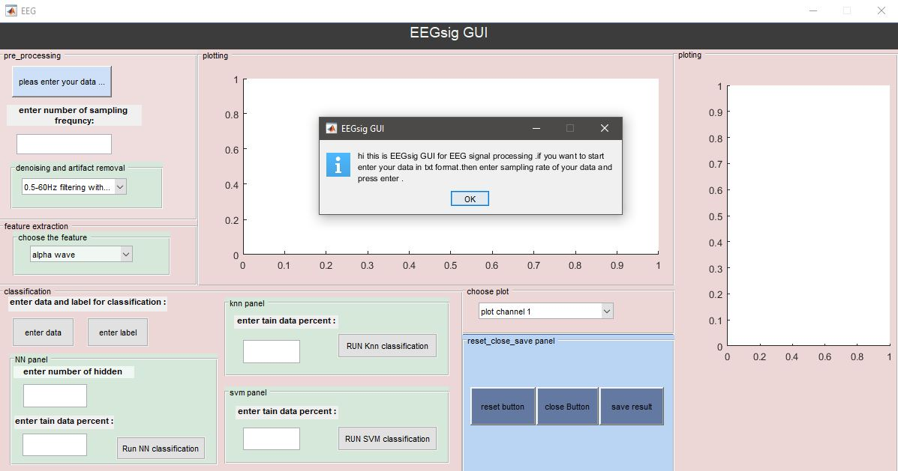
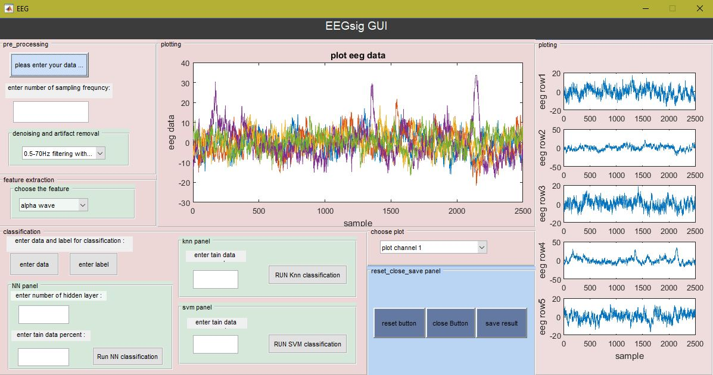



# EEGsig: an open-source machine learning-based toolbox for EEG signal processing

[EEGsig: an open-source machine learning-based toolbox for EEG signal processing](https://arxiv.org/abs/2010.12877)

### Author : [Fardin Ghorbani](https://scholar.google.com/citations?user=Ld-lFKgAAAAJ&hl=en), [Javad Shabanpour](https://scholar.google.com/citations?user=WLstfRcAAAAJ&hl=en), [Sepideh Monjezi](https://scholar.google.com/citations?user=JOXckEEAAAAJ&hl=en), [Hossein Soleimani](https://scholar.google.com/citations?user=fY5IgjcAAAAJ&hl=en), [Soheil Hashemi](https://scholar.google.com/citations?user=N6CGwhMAAAAJ&hl=en), [Ali Abdolali](https://scholar.google.com/citations?user=JYpUTf8AAAAJ&hl=en)

*Abstract : In the quest to realize a comprehensive EEG signal processing framework, in this paper, we demonstrate a toolbox and graphic user interface, EEGsig, for the full process of EEG signals. Our goal is to provide a comprehensive suite, free and open-source framework for EEG signal processing where the users especially physicians who do not have programming experience can focus on their practical requirements to speed up the medical projects. Developed on MATLAB software, we have aggregated all the three EEG signal processing steps, including preprocessing, feature extraction, and classification into EEGsig. In addition to a varied list of useful features, in EEGsig, we have implemented three popular classification algorithms (K-NN, SVM, and ANN) to assess the performance of the features. Our experimental results demonstrate that our novel framework for EEG signal processing attained excellent classification results and feature extraction robustness under different machine learning classifier algorithms. Besides, in EEGsig, for selecting the best feature extracted, all EEG signal channels can be visible simultaneously; thus, the effect of each task on the signal can be visible. We believe that our user-centered MATLAB package is an encouraging platform for novice users as well as offering the highest level of control to expert users.*

# EEGsig toolbox

