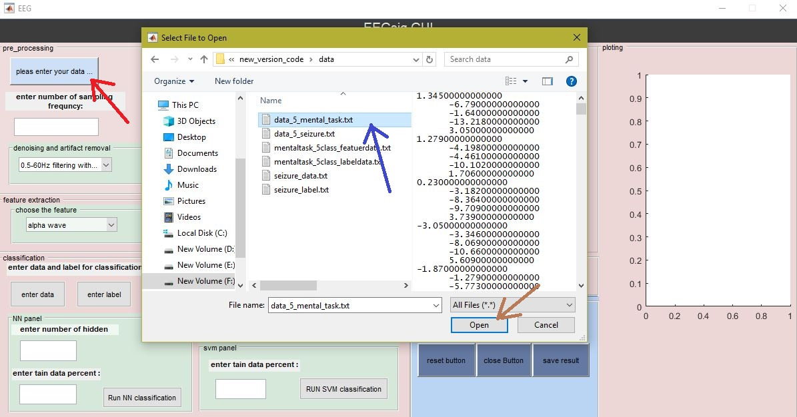
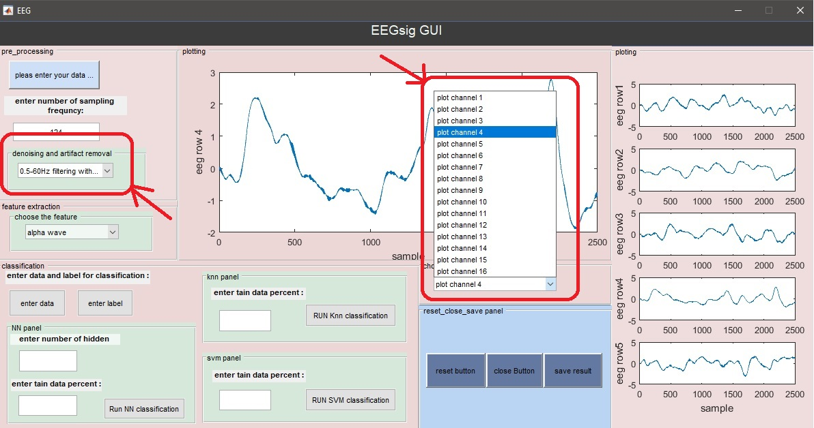
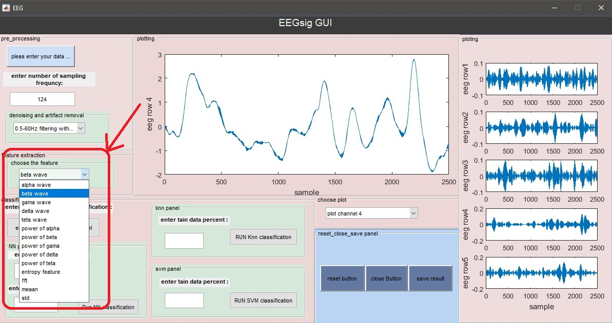
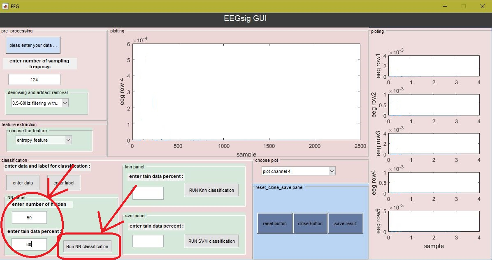
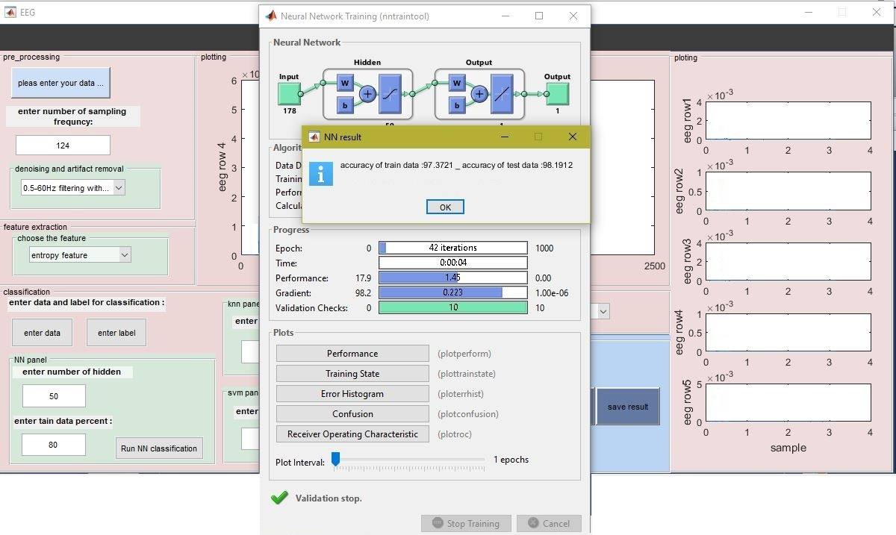
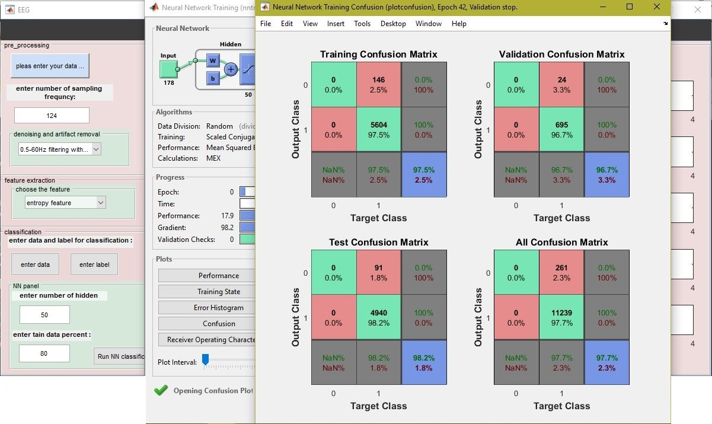



# EEGsig: an open-source machine learning-based toolbox for EEG signal processing

[EEGsig: an open-source machine learning-based toolbox for EEG signal processing](https://arxiv.org/abs/2010.12877)

### Author : [Fardin Ghorbani](https://scholar.google.com/citations?user=Ld-lFKgAAAAJ&hl=en), [Javad Shabanpour](https://scholar.google.com/citations?user=WLstfRcAAAAJ&hl=en), Sepideh Monjezi, [Hossein Soleimani](https://scholar.google.com/citations?user=fY5IgjcAAAAJ&hl=en), [Soheil Hashemi](https://scholar.google.com/citations?user=N6CGwhMAAAAJ&hl=en), [Ali Abdolali](https://scholar.google.com/citations?user=JYpUTf8AAAAJ&hl=en)

### Abstract : In the quest to realize a comprehensive EEG signal processing framework, in this paper, we demonstrate a toolbox and graphic user interface, EEGsig, for the full process of EEG signals. Our goal is to provide a comprehensive suite, free and open-source framework for EEG signal processing where the users especially physicians who do not have programming experience can focus on their practical requirements to speed up the medical projects. Developed on MATLAB software, we have aggregated all the three EEG signal processing steps, including preprocessing, feature extraction, and classification into EEGsig. In addition to a varied list of useful features, in EEGsig, we have implemented three popular classification algorithms (K-NN, SVM, and ANN) to assess the performance of the features. Our experimental results demonstrate that our novel framework for EEG signal processing attained excellent classification results and feature extraction robustness under different machine learning classifier algorithms. Besides, in EEGsig, for selecting the best feature extracted, all EEG signal channels can be visible simultaneously; thus, the effect of each task on the signal can be visible. We believe that our user-centered MATLAB package is an encouraging platform for novice users as well as offering the highest level of control to expert users

# Tutorial for Working with EEGsig

## How to use EEGsig for pre-processing and feature extraction?

### First run the EEG.mat file with MATLAB software

*Figure 1* .*After running EEG.mat, the software is run and we see the following image*

### Now in this step we have to load the desired data in EEGsig

*Figure 2* .*To load the data, press the button marked with a red arrow*

*Figure 3* .*Then we load the desired data from the data folder*

*Figure 4* . *Our data is then displayed automatically*

### Then it is time to enter the sampling frequency

It is important to note that since the frequency range of the EEG signal is between 0.5 and 60 Hz, in order to comply with the Nyquist principle, the data sampling frequency must be more than 2 times 60 Hz, i.e. more than 120 Hz.

*Figure 5* .*After entering the data in the desired location, press the Enter key*

### Next step is denoise and artifact removal

*Figure 6* . *Now we have to select the denoise and artifact removal by selecting it in the red box on the left and then select the desired channel to view each channel in a larger size.*

### Then it is time to enter the sampling frequency

*Figure 7* . *Select the desired feature to extract the data and display it*

## How to use EEGsig classification?

### First, we have to load the feature data and its corresponding label in the software

*Figure 8* . *First, we load the feature data by pressing the button marked with a red arrow*

*Figure 9* . *Then, by pressing the button marked with a red arrow, we load the labels*

### Now we select one of the available algorithms and enter the desired parameters

*Figure 10* .*Here we select the neural network and enter the number of hidden layer neurons and the percentage of training data and then we hit the run button*.

 ### Now we can see the results

